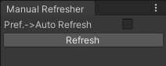

# Unity Manual Refresher
A tool for manual asset refreshing. If enabled, unity will no longer auto refresh and compile assets that have been changed. Useful if you don't want to compile every time you change the code slightly.

When enabled, assets will be refreshed when entering play mode or when the refresh button is pressed.

Default shortcut for manual refresh: Shift + C

Found in Tools->Manual Refresher

The auto refresh toggle will change settings in preferences->asset pipeline.
